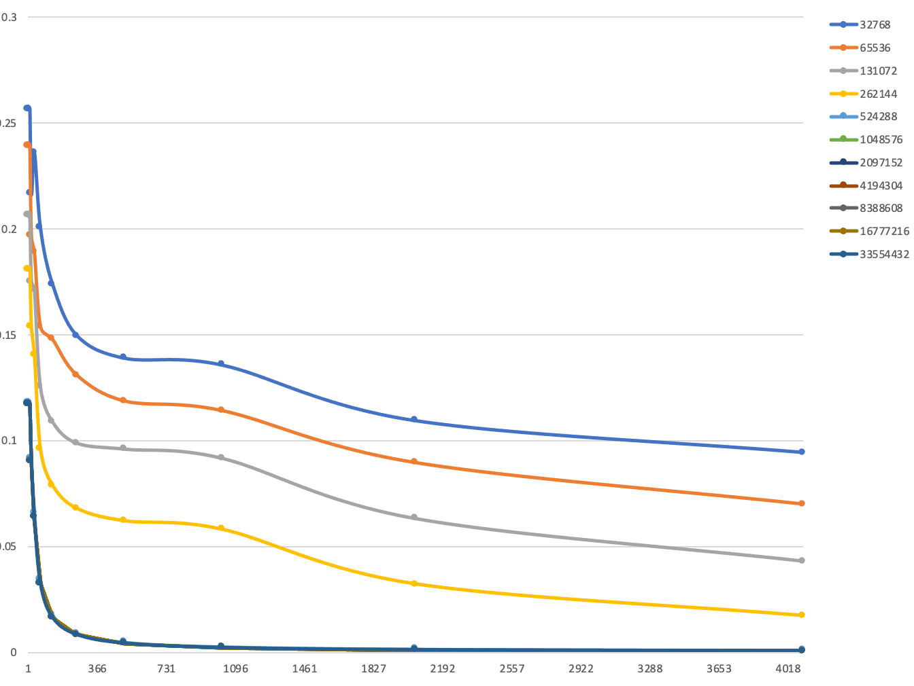
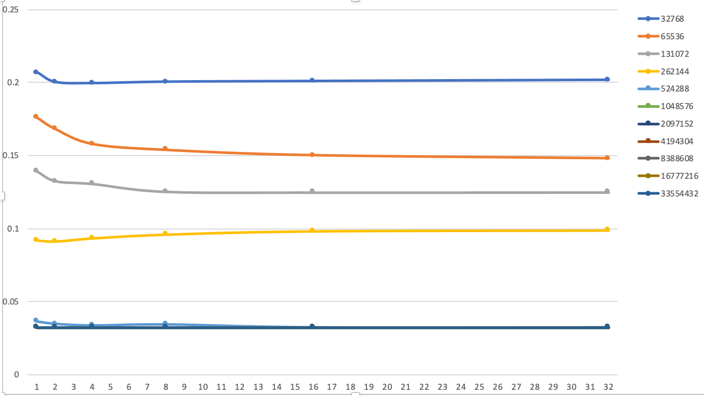
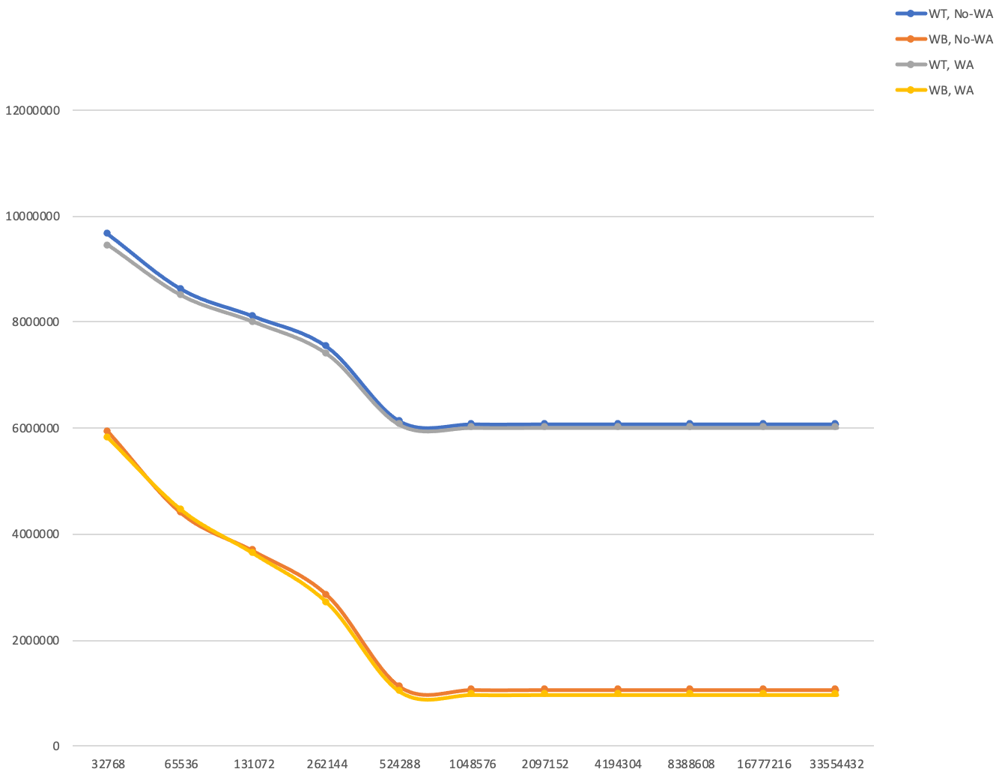
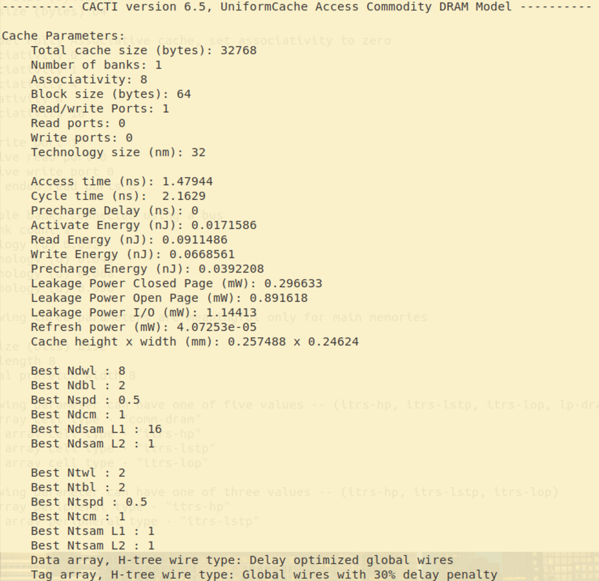
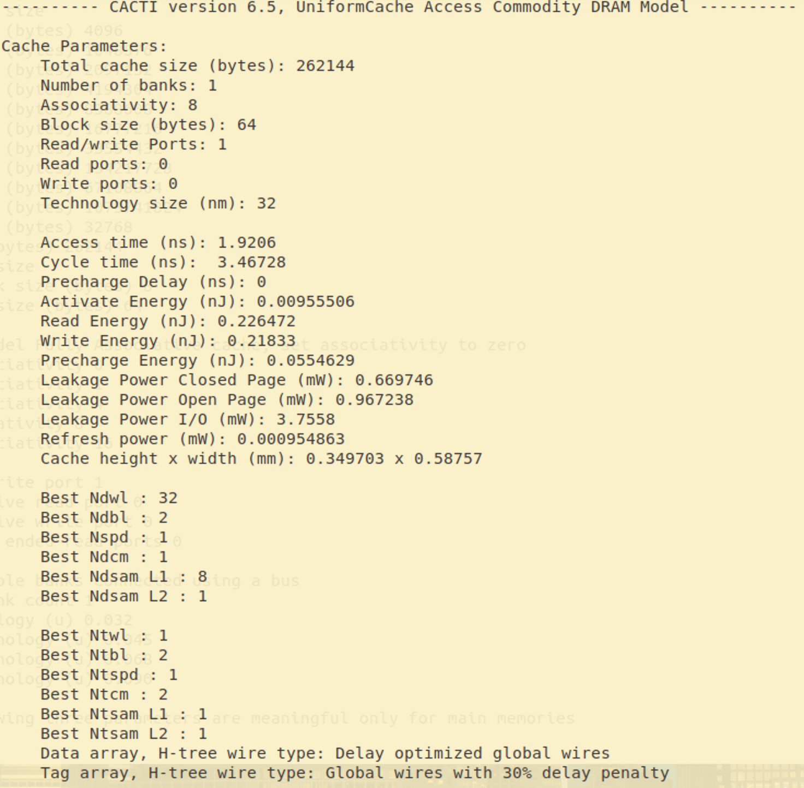

# 计算机组织与体系结构实习Lab3

# 高速缓存的模拟、配置和优化

## 单级Cache模拟

单层Cache模拟器，主程序在`source-code/CacheMain.cpp`中，主要负责读取`trace`文件，并执行Cache模拟。由于第二阶段需与CPU模拟器级联，故新编写`Cache.cpp`文件并修改原有文件使得可以正确运行。

### `MemoryManager`模块修改

主存在本次试验中是最底层的存储器，故对于主存必然命中。主存对于读取字节的响应延迟应为总线延迟和主存命中延迟之和。主存对于写若干字节的响应延迟应为总线延迟和主存命中延迟之和。

将原有`get`,`set`函数修改，均加入延迟时间计算。

### `Cache`模块设计

缓存在运行过程中，会不停接收到读、写请求，根据自身情况，分别响应读命中、读不命中、写命中、写不命中。

对于读命中，从存储中取出内容，经过总线延迟和命中延迟完成动作。

对于读不命中，首先找到空闲块或待替换的块，若`write_back`为真，则将被替代块写回下一层存储，再向下一层存储发出读请求替换至准备好的块中，再进行读命中操作，需经过总线延迟和命中延迟再加上下一级的延迟来完成。

对于写命中，若`write_back`为真，则设置`dirty`为真，之后进行写入操作。若`write_back`为真，需经总线延迟与命中延迟完成；否则，需向下一级存储发出写请求，等待下一级存储也写入完成，需总线延迟、命中延迟和下一级的延迟完成。

对于写不命中，若`write_alloc`为真，则需先替换块，再根据`wirte_back`决定写入时的操作。需要总线延迟、命中延迟再加上下一级的延迟完成；否则，直接向下一级传递请求，需总线延迟、命中延迟、下一级延迟完成。

### Miss Rate 随 Block Size 的变化



如图所示为在不同Cache Size的条件下，Miss Rate 随 Block Size的变化趋势，取associativity为8。可以看出，随着Block Size的增大，Miss Rate会逐渐减小至一稳定值。

### Miss Rate 随 Associativity 的变化



如图所示，为固定Block Size 为64Byte，Miss Rate随Associativity的变化趋势。可以看出，绝大多数情况，随着associativity的增大，Miss Rate也会逐渐减小至一稳定值。

## Write Through, Write Back, Write Allocate和 No-write Allocate访问延时差异



如图所示，在不同的写策略时，总访问延时有一定区别。可以看到，Write Back策略访问延时明显低于Write Through；Write Allocate对延时的减小有微弱的帮助。

## 与CPU模拟器级联

修改`Simulator`模块、主程序模块，将Cache加入至流水线模拟之中。

这里采用Cache模块计算访存延迟并返回给流水线模拟器，再将该延迟加入到流水线模拟器的周期数中，以便计算CPI

| Level | Capacity | Associativity | Block Size | Write Policy | Hit Latency  |
| ----- | -------- | ------------- | ---------- | ------------ | ------------ |
| L1    | 32KB     | 8 ways        | 64         | Write Back   | 1 CPU Cycle  |
| L2    | 256KB    | 8 ways        | 64         | Write Back   | 8 CPU Cycle  |
| LLC   | 8MB      | 8 ways        | 64         | Write Back   | 20 CPU Cycle |

### 程序运行结果

```bash
$ ./Sim ../$dir/others/ackermann.riscv
Ackermann(0,0) = 1
Ackermann(0,1) = 2
Ackermann(0,2) = 3
Ackermann(0,3) = 4
Ackermann(0,4) = 5
Ackermann(1,0) = 2
Ackermann(1,1) = 3
Ackermann(1,2) = 4
Ackermann(1,3) = 5
Ackermann(1,4) = 6
Ackermann(2,0) = 3
Ackermann(2,1) = 5
Ackermann(2,2) = 7
Ackermann(2,3) = 9
Ackermann(2,4) = 11
Ackermann(3,0) = 5
Ackermann(3,1) = 13
Ackermann(3,2) = 29
Ackermann(3,3) = 61
Ackermann(3,4) = 125
Program exit from exit() system call
-------STATISTICS---------
Number of Cycles: 520797
Number of Instructions: 430659
Avg Cycles per Instrcution: 1.2093
Number of JALR Instructions: 13740
Number of JAL Instructions: 20734
Number of LOAD Instructions: 95400
Number of STORE Instructions: 68308
Number of BRANCH Instructions: 27451
Number of Successful Prediction: 13847
Number of Unsuccessful Prediction: 13604
Branch Prediction Accuracy: 0.5044 (Using Strategy: Always Not Taken)
Number of Control Hazards: 61860
Number of Data Hazards: 307250
Number of Structural Hazards: 27192
-----------------------------------
```

从中可以看出，运行结果正确。

### CPI对比

下表给出带Cache和不带Cache的程序运行CPI

| 文件名        | CPI of Ideal<br />Memory | CPI with<br /> Cache | CPI without<br />Cache |
| ------------- | ------------------------ | -------------------- | ---------------------- |
| `helloworld`  | 1.2168                   | 1.8042               | 27.0909                |
| `quicksort`   | 1.3427                   | 1.3550               | 49.2958                |
| `matrixmulti` | 1.2254                   | 1.2320               | 39.0974                |
| `ackermann`   | 1.2060                   | 1.2093               | 39.2194                |

在没有Cache的模拟器中，所有访存周期都为1个周期，当引入Cache后，CPI均有所增加，这是因为引入Cache后，我们访存操作都需要不止一个周期。

从表中可以看出，不同程序其CPI差异很大，局部性好的程序CPI增加幅度小，如矩阵乘法，其数据大多在一个block内，引入Cache带来的性能损失非常小。

当我们去掉Cache并设置访存周期为100时，我们发现引入Cache基本上都能将CPI下降很多，这说明减小访存延迟，合理设计Cache规模对计算机性能的影响是巨大的。

## 高速缓存管理策略优化

采用两级Cache，默认配置如下

| Level | Capacity | Associativity | Line size(Bytes) | Write Policy | Bus Latency | Hit Latency   |
| ----- | -------- | ------------- | ---------------- | ------------ | ----------- | ------------- |
| L1    | 32KB     | 8 ways        | 64               | Write Back   | 0 CPU Cycle | ?             |
| L2    | 256KB    | 8 ways        | 64               | Write Back   | 6 CPU Cycle | ?             |
| Mem   | $\infty$ |               |                  |              | 0           | 100 CPU Cycle |

其中Bus Latency为总线延迟，即本层接到上层发来请求和本层返回数据给上层时间延迟之和，Hit Latency为本层查找数据所需时间，只要没使用bypass该延时始终存在。假设CPU和主存频率为2GHz，主存无限大。

### 计算Hit Latency

安装cacti依赖库

```bash
sudo apt install gcc-multilib g++-multilib
```

修改`cacti`配置文件

```ini
-size (bytes) ???
-block size (bytes) ?
-associativity ?
-technology (u) 0.032
-cache type "cache"
```

得到运行结果





从图中可以看出， 

```bash
默认配置下，32nm工艺节点下，L1 Cache的 Hit Latency 为（1.47944）ns，约等于（3）cycle
- 默认配置下，32nm工艺节点下，L2 Cache的 Hit Latency 为（1.9206）ns，约等于（4）cycle
```

故，默认配置下，Cache的全部参数如下表

| Level | Capacity | Associativity | Line size(Bytes) | Write Policy | Bus Latency | Hit Latency   |
| ----- | -------- | ------------- | ---------------- | ------------ | ----------- | ------------- |
| L1    | 32KB     | 8 ways        | 64               | Write Back   | 0 CPU Cycle | 3 CPU Cycle   |
| L2    | 256KB    | 8 ways        | 64               | Write Back   | 6 CPU Cycle | 4 CPU Cycle   |
| Mem   | $\infty$ |               |                  |              | 0           | 100 CPU Cycle |

### 默认配置运行trace2017

使用LRU替换算法，无任何优化算法，使用命令

```bash
./CacheYouhuaSim ../cache-trace/???.trace 100
```

运行提供的两个trace文件共一百次。

| Trace                    | Level | Latency | Miss Rate | AMAT      |
| :----------------------- | ----- | :------ | :-------: | --------- |
| 01-mcf-gem5-xcg.trace    | L1    | 3       | 0.200455  | 11.548831 |
|                          | L2    | 10      | 0.396080  |           |
|                          | Mem   | 100     |     x     |           |
| 02-stream-gem5-xaa.trace | L1    | 3       | 0.113404  | 11.501351 |
|                          | L2    | 10      | 0.755171  |           |
|                          | Mem   | 100     |     x     |           |

其中AMAT计算公式为
$$
AMAT1 = (1-0.200455)*3+0.200455*[(1-0.396080)*10+0.396080*100]\\
AMAT2 = (1-0.113404)*3+0.113404*[(1-0.755171)*10+0.755171*100]
$$

### 优化策略

#### 替换策略

默认策略是LRU策略，考虑使用随机算法、PLRU算法替换，测试100轮。

| Trace                    | Level | Miss Rate<br />LRU | Miss Rate<br />Random | Miss Rate<br />PLRU | AMAT<br />LRU | AMAT<br />Random | AMAT<br />PLRU |
| :----------------------- | ----- | :----------------: | :-------------------- | ------------------- | ------------- | ---------------- | -------------- |
| 01-mcf-gem5-xcg.trace    | L1    |      0.200455      | 0.204337              | 0.200588            | 11.548831     | 11.017709        | 11.399391      |
|                          | L2    |      0.396080      | 0.358196              | 0.387487            |               |                  |                |
| 02-stream-gem5-xaa.trace | L1    |      0.113404      | 0.113483              | 0.113404            | 11.501351     | 11.651742        | 11.501351      |
|                          | L2    |      0.755171      | 0.769313              | 0.755171            |               |                  |                |

从上表中可以看出，Random算法和PLRU算法与LRU算法的性能差不多。但由于Random算法具有随机性和不稳定性，所以Random算法不能作为好的替代算法。 虽然PLRU算法比LRU算法提高幅度较小，但由于其为稳定的算法，所以PLRU是好的替代算法。再，LRU的时间复杂度为O(associativity)，而PLRU为O(log(associativity))，可见PLRU速度也要比LRU快，虽然一般来说associativity都不大。

所以，采用PLRU算法替代LRU算法是合理的。

#### Bypass策略

我们能想象到，在程序执行过程中，可能仅一次执行某些指令，且在这些指令周围的其他指令也不被执行，那么对于这类指令，如果我们需要其的时候，将其更新至Cache，这就发生了一次很长的访问，首先从主存中加载到L2 Cache，再从L2 Cache加载到L1 Cache然后返回。这样的数据装入Cache，只使用一次，使得Cache的表现变得糟糕。因此，对于这种情况，不应该加载到Cache中，应该直接从下层存储中返回该数据，即Bypass.

使用MCT决定Bypass，MCT为一个记录历史载入Line的表格，其一行对应一个associativity，每行中可以有若干个Tag，遵循FIFO原则。对于上述提到的现象，我们只需考虑由于CacheSize引起的Capacity Miss即可，即在Cache Set和MCT均已满且在MCT中找不到相应的Tag时，进行Bypass防止Cache污染。

采用默认配置，使用PLRU算法，分别在L1和L2上开启Bypass策略且每个MCT最多8个Tag，测试100轮。

| Trace     | Level | MR<br />No | MR<br />L1 | MR<br />L2 | MR<br />L1+L2 | AMAT<br />No | AMAT<br />L1 | AMAT<br />L2 | AMAT<br />L1+L2 |
| --------- | ----- | ---------- | ---------- | ---------- | ------------- | ------------ | ------------ | ------------ | --------------- |
| mcf.trace | L1    | 0.200588   | 0.246338   | 0.200588   | 0.246338      | 11.399391    | 12.593709    | 9.770219     | 13.380823       |
|           | L2    | 0.387487   | 0.354947   | 0.367518   | 0.390450      |              |              |              |                 |
| xaa.trace | L1    | 0.113404   | 0.223658   | 0.113404   | 0.223658      | 11.501351    | 13.331245    | 12.275317    | 20.152812       |
|           | L2    | 0.755171   | 0.435468   | 0.831003   | 0.774357      |              |              |              |                 |

从上表中可以看到，对于局部性好的trace，当开启L2 Bypass时AMAT有较好的优化性能，而开启L1 Bypass均会降低性能。对于流水式的trace，局部性很差，这时关闭Bypass可以降低Miss Rate。这一试验结果不难理解，当局部性好时，偶尔一个远距离的内存访问，Bypass可以防止Cache被污染以获得较好的性能。

所以，Bypass优化策略为仅对L2开启。

然后，通过实验选择不同的MCT Size，每组测试10次。

| Trace     | MCT Size | MR L1    | MR L2    | AMAT      |
| --------- | -------- | -------- | -------- | --------- |
| mcf.trace | 1        | 0.200588 | 0.331128 | 10.381955 |
|           | 2        | 0.200588 | 0.322439 | 10.225081 |
|           | 4        | 0.200588 | 0.324212 | 10.257096 |
|           | 8        | 0.200588 | 0.367518 | 11.038902 |
|           | 16       | 0.200588 | 0.386600 | 11.383383 |
|           | 32       | 0.200588 | 0.387629 | 11.383383 |
|           | 64       | 0.200588 | 0.387487 | 11.401952 |
|           | 128      | 0.200588 | 0.387487 | 11.399391 |
|           | 256      | 0.200588 | 0.387487 | 11.399391 |
| xaa.trace | 1        | 0.113404 | 0.831003 | 12.275317 |
|           | 2        | 0.113404 | 0.831003 | 12.275317 |
|           | 4        | 0.113404 | 0.831003 | 12.275317 |
|           | 8        | 0.113404 | 0.831003 | 12.275317 |
|           | 16       | 0.113404 | 0.831003 | 12.275317 |
|           | 32       | 0.113404 | 0.776347 | 11.463847 |
|           | 64       | 0.113404 | 0.755171 | 11.501351 |
|           | 128      | 0.113404 | 0.755171 | 11.501351 |
|           | 256      | 0.113404 | 0.755171 | 11.501351 |

上表中 mcf.trace代表局部性良好的trace，xaa.trace代表局部性不好的trace，权衡考虑，取Size为2。由于绝大多数程序都是局部性较好的程序，此时若MCT Size为零，则会出现Cache污染，若MCT Size较大，所有出现过的都会被记录下来不再bypass，也会造成性能的降低。

综上所述，L2缓存使用Bypass策略，且MCT Size（即历史Tag）为2.

#### Prefetch策略

