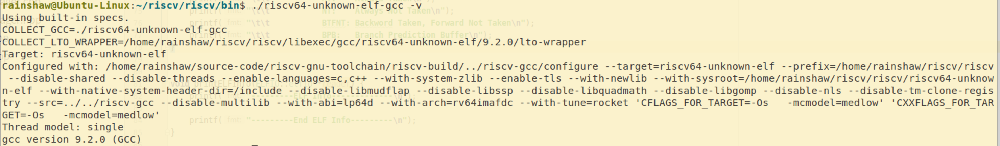
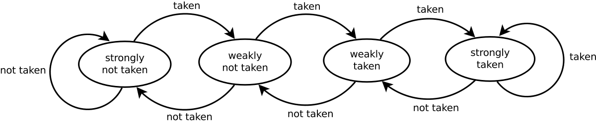
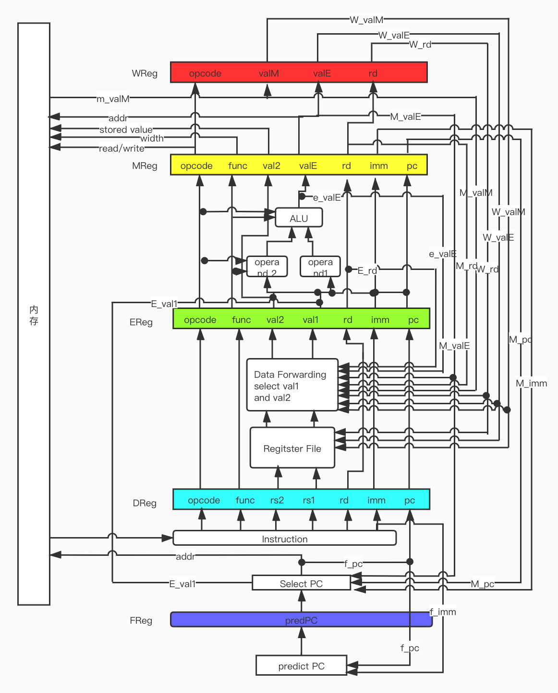

# 计算机组织与体系结构实习Lab 2

物理学院 郜瑞啸 1600011378

## 一、开发环境

### 1.1 RISCV交叉编译工具的安装和使用

为测试模拟器的正确性，必须将源程序编译为基于RISCV指令的可执行程序，而由于个人计算机一般是x86架构的，所以需要交叉编译工具在x86电脑上编译生成RISCV架构可执行程序。

为配置环境，执行了以下操作

从[Github](https://github.com/riscv/riscv-tools)上下载了`riscv-tools`，从`issues`中得知，交叉编译工具已移动到`riscv-gnu-toolchain`项目中，于是执行了以下命令

```bash
cd ~ && mkdir source-code && cd "$_"
git clone --recursive https://github.com/riscv/riscv-gnu-toolchain
cd riscv-gnu-toolchain
```

注意到在编译`riscv-gnu-toolchain`时，默认配置为支持`RV64IMAFDC`指令集，即`RV64GC`指令集，如下图，此时使用该工具编译时即使设置参数`-Wa, -march=rv64i`仍会链接使用扩展指令集的标准函数，其中`C`指令很多，并且导致我们的模拟器无法从程序入口执行，必须寻找`main`函数的位置。

所以，为了得到只使用`RV64I`的`ELF`程序，必须在编译`riscv-gnu-toolchain`时便指定指令集，于是执行了以下命令

```bash
# cd riscv-gnu-toolchain
mkdir build-rv64i && cd "$_"
../configure --with-arch=rv64i --prefix=$HOME/riscv/riscv64i
make -j$(nproc)
```

此时，使用`riscv64-unknown-elf-gcc`对测试代码编译时，便只会使用`RV64I`标准集的指令，为了谨慎起见，我仍然在编译命令中加入了相关参数。编译指令示例如下

```bash
$HOME/riscv/riscv64i/bin/riscv64-unknown-elf-gcc -Wa,-march=rv64i test/matrixmulti.c test/lib.c -o riscv-elf/others/matrixmulti.riscv
$HOME/riscv/riscv64i/bin/riscv64-unknown-elf-objdump -D riscv-elf/others/matrixmulti.riscv > riscv-elf/others/matrixmulti.s
```

除`RV64I`基本指令集外，我还额外实现了`M`扩展集的部分指令，所以上述命令修改为

```bash
mkdir build-rv64im && cd "$_"
../configure --with-arch=rv64im --prefix=$HOME/riscv/riscv64i
make -j$(nproc)
$HOME/riscv/riscv64im/bin/riscv64-unknown-elf-gcc -Wa,-march=rv64im test/matrixmulti.c test/lib.c -o riscv-elf/others/matrixmulti.riscv
$HOME/riscv/riscv64im/bin/riscv64-unknown-elf-objdump -D riscv-elf/others/matrixmulti.riscv > riscv-elf/others/matrixmulti.s
```

在我编写的编译测试代码的脚本文件中，均含有以下三句

```bash
dir=~/riscv/riscv64im/bin
rvgcc=$dir/riscv64-unknown-elf-gcc
flags='-Wa,-march=rv64im'
```

通过修改`dir` `flags`参数可以改变上述命令中的编译器位置和编译选项。脚本中默认为使用`--with-arch=rv64im`参数编译生成的编译器，并且编译测试代码时的编译选项为`-Wa,-march=rv64im`。

## 二、设计概述

### 2.1 设计目标

首要目标是实现一个流水线的模拟器，能够处理基本指令集，完成程序设计目标，并且程序的鲁棒性必须好，应该能够实现拒绝不正常的内存访问等。

其次，由于程序没有实现并行操作，实际上仍然是依次顺序执行5个阶段，所以部分冒险情况可以被简化。

此外，本模拟器没有选择兼容`Linux`的系统调用，而是选择使用自定义的系统调用，因此只能运行专门为此编写的程序（相关源码参见`test/`文件夹），同时，由于课程作业中提供的测试文件均没有包含特殊的系统调用，因此本模拟器也可以运行它们（相关源码参见`test-inclass/`文件夹）。

### 2.2 编译与运行

本项目提供了一个自动化脚本`runme.sh`，用于编译本模拟器，并模拟运行测试程序。或者可以采用手动方式，命令如下

```bash
# cd /path/to/project
mkdir build && cd "$_"
cmake ..
make
```

之后会得到可执行程序`Sim`，是一个命令行程序，相关参数列出如下

```bash
rainshaw@Ubuntu-Linux:~/CLionProjects/RISCV-Simulator/build$ ./Sim
Usage: ./Sim riscv-elf-file-name [-v] [-d] [-s] [-b para]
        Parameters:
                [-v]: to use verbose mode
                [-d]: to dump memory and reg
                [-s]: to enter single step mode
                [-b para]: claim branch perdiction strategy
                           accpeted para: AT, NT, BTFNT, BPB
                           AT:    Always Taken
                           NT:    Always Not Taken
                           BTFNT: Backword Taken, Forward Not Taken
                           BPB:   Branch Prediction Buffer
```

其中`riscv-elf-file-name`是`riscv elf`可执行文件的路径，一个典型的运行流程和输出如下：

```bash
rainshaw@Ubuntu-Linux:~/CLionProjects/RISCV-Simulator/build$ ./Sim ../riscv-elf/others/matrixmulti.riscv
The content of A is: 
0 0 0 0 0 0 0 0 0 0 
1 1 1 1 1 1 1 1 1 1 
2 2 2 2 2 2 2 2 2 2 
3 3 3 3 3 3 3 3 3 3 
4 4 4 4 4 4 4 4 4 4 
5 5 5 5 5 5 5 5 5 5 
6 6 6 6 6 6 6 6 6 6 
7 7 7 7 7 7 7 7 7 7 
8 8 8 8 8 8 8 8 8 8 
9 9 9 9 9 9 9 9 9 9 
The content of B is: 
0 1 2 3 4 5 6 7 8 9 
0 1 2 3 4 5 6 7 8 9 
0 1 2 3 4 5 6 7 8 9 
0 1 2 3 4 5 6 7 8 9 
0 1 2 3 4 5 6 7 8 9 
0 1 2 3 4 5 6 7 8 9 
0 1 2 3 4 5 6 7 8 9 
0 1 2 3 4 5 6 7 8 9 
0 1 2 3 4 5 6 7 8 9 
0 1 2 3 4 5 6 7 8 9 
The content of C=A*B is: 
0 0 0 0 0 0 0 0 0 0 
0 10 20 30 40 50 60 70 80 90 
0 20 40 60 80 100 120 140 160 180 
0 30 60 90 120 150 180 210 240 270 
0 40 80 120 160 200 240 280 320 360 
0 50 100 150 200 250 300 350 400 450 
0 60 120 180 240 300 360 420 480 540 
0 70 140 210 280 350 420 490 560 630 
0 80 160 240 320 400 480 560 640 720 
0 90 180 270 360 450 540 630 720 810 
Program exit from exit() system call
-------STATISTICS---------
Number of Cycles: 105024
Number of Instructions: 72502
Avg Cycles per Instrcution: 1.4486
Number of JALR Instructions: 643
Number of JAL Instructions: 1106
Number of LOAD Instructions: 22984
Number of STORE Instructions: 4474
Number of BRANCH Instructions: 1722
Number of Successful Prediction: 163
Number of Unsuccessful Prediction: 1559
Branch Prediction Accuracy: 0.0947 (Using Strategy: Always Not Taken)
Number of Control Hazards: 3160
Number of Data Hazards: 77031
Number of Structural Hazards: 4334
-----------------------------------
```

在默认情况下，模拟器会先运行程序，处理程序的输入和输出，当该程序运行结束后，模拟器会打印本次运行过程中的统计数据。

程序还支持单步调试模式，和啰嗦模式，分别是`-s`和`-s`参数。在单步模式中，可以输入`d`来保存内存快照，使用其他案件前进到下一条指令。`-b`参数可以指定用于分支预测的策略。

> 本项目提供了一个自动化脚本`build.sh`，用以编译测试代码（需要自行修改相关脚本中的`riscv64-unknown-elf-gcc`程序的位置）。但无需这样做，因为提交版本中已经保留了相关编译后的`riscv`可执行文件，并且如果采用非`--with-arch=rv64im`选项生成的编译器来生成`riscv`可执行文件，本程序可能无法正常处理`C`类压缩指令。

## 三、具体实现

### 3.1 代码架构

模拟器总体为一个类`Simulator`，其中包含了通用寄存器、流水线寄存器、历史记录、内存模块和分支预测模块。其中，内存模块和分支预测模块被单独拿出来构成了独立的类`MemoryManager`和`BranchPredictor`。

### 3.2 可执行文件的装载、初始化

本程序使用了开源库[ELFIO](https://github.com/serge1/ELFIO)，使用库函数使得加载`ELF`文件的操作非常简单，相关代码如下：

```cpp
void loadElf(ELFIO::elfio *reader, MemoryManager *memory) {
    ELFIO::Elf_Half seg_num = reader->segments.size();
    if (verbose) {
        printf("-------load ELF-------\n");
    }
    for (uint32_t i = 0; i < seg_num; i++) {
        const ELFIO::segment *seg_pointer = reader->segments[i];
        uint64_t full_mem = seg_pointer->get_memory_size();
        uint64_t full_addr = seg_pointer->get_virtual_address();
        if (full_addr + full_mem > 0xFFFFFFFF) {
            printf("ELF address space is larger than 32bit!\n");
            printf("Still could not deal with it!\n");
            exit(-1);
        }
        uint32_t file_size = (uint32_t) seg_pointer->get_file_size();
        uint32_t mem_size = (uint32_t) full_mem;
        uint32_t addr = (uint32_t) full_addr;
        for (uint32_t pos = addr; pos < addr + mem_size; pos++) {
            if (!memory->pageExist(pos)) {
                memory->addPage(pos);
            }
            if (pos < addr + file_size) {
                memory->setByte(pos, seg_pointer->get_data()[pos - addr]);
            } else {
                memory->setByte(pos, 0);
            }
        }
    }
    if (verbose) {
        printf("-----------------------\n");
    }
}
```

并且在进入模拟时使用库函数传递程序入口给模拟器

```cpp
simulator.run(reader.get_entry());
```

> 一坑：可执行文件内的数据长度可能小于指定的内存长度，需要用0填充，否则会导致奇怪的bug

### 3.3 内存模块`MemoryManager`

内存模块应该足够健壮，应该有足够的空间，并可以处理非法操作，这与操作系统中的虚拟内存很像，于是仿照`x86`架构设计了二级页表的机制，具体而言，将32位的内存空间在逻辑上划分为`4kB`的页，每一页有$2^{12}$个`Byte`，并且采用前10位作为一级页表的索引，第11到20位作为二级页表的索引，最后12位作为页内的偏移。

> 一注：也就是说本程序最大只支持32位内存，一般的用户程序如果不发生内存泄漏，32位内存是完全够用的，毕竟我给虚拟机也只分配了1G内存，\_(:з」∠)\_

模拟器对`memory`的一个访存过程如下：

```cpp
uint8_t MemoryManager::getByte(uint32_t addr){
    if(!this->addrExist(addr)){
        printf("Memory read from invalid addr 0x%x!\n", addr);
        exit(-1);
        return false;
    }
    uint16_t i = this->getFirstIndex(addr);
    uint16_t j = this->getSecondIndex(addr);
    uint16_t k = this->getPageOffset(addr);
    return this->memory[i][j][k];
}
```

### 3.4 分支预测模块`BranchPrediction`

本模拟器实现了如下几种策略

| 策略名称 | 说明                         |
| :------- | :--------------------------- |
| AT       | Always Taken                 |
| NT       | Always Not Taken             |
| BTFNT    | Back Taken Forward Not Taken |
| BPB      | Branch Prediction Buffer     |

其中，`BPB`模式采用内存后12位维护一个长度为$2^{12}=4096$的直接映射高速缓存，用于存储该指令的状态。本模拟器中的缓存状态有四种，他们之间的转换关系如下图：




具体实现如下：

```cpp
bool BranchPredictor::predict(uint32_t pc, int64_t offset){
    switch(this->strategy){
        case AT:
            return true;
        case NT:
            return false;
        case BTFNT:
            return offset<0;
        default:
            //assert(this->strategy == BPB);
            PredictorState state = this->predbuf[pc & 0xFFFu];
            if(state == STRONG_TAKEN || state == WEAK_TAKEN){
                return true;
            }
            else if(state == WEAK_NOT_TAKEN || state == STRONG_NOT_TAKEN){
                return false;
            }
            break;
    }
    return false;
}


void BranchPredictor::update(uint32_t pc, bool branch){
    if(strategy == BPB){
        int index = (int)(pc & 0xFFFu);
        PredictorState state = this->predbuf[index];
        if(branch){
            if (state == STRONG_TAKEN){
                return;
            }
            else if(state == WEAK_TAKEN){
                this->predbuf[index] = STRONG_TAKEN;
                return;
            }
            else if(state == WEAK_NOT_TAKEN){
                this->predbuf[index] = WEAK_TAKEN;
                return;
            }
            else{
                //assert(state == STRONG_NOT_TAKEN);
                this->predbuf[index] = WEAK_NOT_TAKEN;
                return;
            }
        }
        else{
            if(state == STRONG_TAKEN){
                this->predbuf[index] = WEAK_TAKEN;
                return;
            }
            else if(state == WEAK_TAKEN){
                this->predbuf[index] = WEAK_NOT_TAKEN;
                return;
            }
            else if(state == WEAK_NOT_TAKEN){
                this->predbuf[index] = STRONG_NOT_TAKEN;
                return;
            }
            else{
                //assert(state==STRONG_NOT_TAKEN);
                return;
            }
        }
    }
}
```

并且在`IF`,`EX`阶段和`run()`函数主体添加相关代码，用以关联`prediction`代码。

### 3.5 模拟器`Simulator`

本模拟器中含有通用寄存器、流水线寄存器、旁路信号、历史记录等。

#### 3.5.1 `run()`函数

模拟器中核心功能是`run()`函数，其接受一个参数`pc`，该参数为程序的入口地址，之后将该地址传递给取址寄存器，之后便进入无限循环中，每一个周期依次执行

```cpp
writeBack(); 			// WB
memoryAccess(); 	// MEM
execute(); 				// EX
decode();					// ID
fetch();					// IF
```

五个函数，每个函数都会以上一周期的流水线寄存器为输入，并输出到下一周期的流水线寄存器中。

上述已经指出，本模拟器没有实现并行执行五个阶段，所以这5个函数的执行过程应该被小心的设计，由于存在数据冒险和结构冒险，我们如果采用正常的顺序，会导致更多的时钟周期被浪费掉，于是采用倒序，这样如果在`ID`阶段需要读取`WB`阶段写回的值，即发生**结构冒险**无需特殊处理，当`ID`阶段需要`EX`阶段的计算值时，也无需等待到下一周期再进行数据转发，直接可以从旁路寄存器中读取相关数值。

在`run()`函数中需要处理的特殊情况如下表：

| 特殊情况     | 条件                                                         | 处理方法                                                     |
| ------------ | ------------------------------------------------------------ | ------------------------------------------------------------ |
| `JALR`       | d_reg.opcode=OP_JALR                                         | 流水线停顿，等待译码完成<br />stall/bubble/normal/normal/normal |
| `LOAD`冒险   | e_reg.opcode=OP_LOAD<br />e_reg.rd in {d_reg.rs1, d_reg.rs2} | 流水线停顿，等待访存完成<br />stall/stall/bubble/normal/normal |
| 执行周期     | e_reg.stall_count != 0                                       | 流水线停顿，等待计算完成<br />stall/stall/stall/bubble/normal |
| 控制冒险出错 | e_reg.opcode=OP_BRANCH<br />e_valE!=predict(e_reg.pc, e_reg.imm) | 取消下两条指令<br />stall/bubble/bubble/normal/normal        |


#### 3.5.2 `writeBack()`函数

写回阶段从`w_reg`寄存器中读取值，判断指令，若为`LOAD`指令，则将从内存中读出的`valM`写入到`rd`寄存器中，对于其他指令，均将`valE`写入到`rd`寄存器中。所以对于那些没有指定`rd`的指令应该将`rd`设置为0号寄存器，并在`writeBack()`函数的最后，判断0寄存器是否仍为0，若非零，则应该重置为0。

```cpp
		switch (opcode) {
        case OP_RR:
        case OP_32:
        case OP_IMM:
        case OP_IMM_32:
        case OP_LUI:
        case OP_AUIPC:
        case OP_ECALL:
        case OP_JAL:
        case OP_JALR:
        case OP_STORE: //rd=0
        case OP_BRANCH: //rd=0
            reg[rd] = valE;
            break;

        case OP_LOAD:
            reg[rd] = valM;
            break;

        case OP_BUBBLE:
            break;
        default:
            this->raiseError("Invaild Instruction When Do Writing Back\n");
            break;
    }
    if (reg[0]) {
        reg[0] = 0;
    }
```

#### 3.5.3 `memoryAccess()`函数

访存阶段从`m_reg`寄存器中读取值，判断指令为`LOAD`则从地址为`valE`的读取数据并传递给`valM`，若指令为`STORE`则向`valE`的地址写入`val2`的值，其它指令不做处理。

```cpp
switch (opcode) {
        case OP_LOAD: {
            history.load_count++;
            switch (func) {
                case 0x0:
                    valM = (int64_t) memory->getByte(valE);
                    break;
                case 0x1:
                    valM = (int64_t) memory->getShort(valE);
                    break;
                case 0x2:
                    valM = (int64_t) memory->getInt(valE);
                    break;
                case 0x3:
                    valM = (int64_t) memory->getLong(valE);
                    break;
                case 0x4:
                    valM = (uint64_t) memory->getByte(valE);
                    break;
                case 0x5:
                    valM = (uint64_t) memory->getInt(valE);
                    break;
                case 0x6:
                    valE = (uint64_t) memory->getInt(valE);
                    break;
                default:
                    this->raiseError("Invaild LOAD Instruction at %x, The Func Field %x is invaild\n", pc, func);
                    break;
            }
            break;
        }
        case OP_STORE:
            history.store_count++;
            switch (func) {
                case 0x0:
                    memory->setByte(valE, val2);
                    break;
                case 0x1:
                    memory->setShort(valE, val2);
                    break;
                case 0x2:
                    memory->setInt(valE, val2);
                    break;
                case 0x3:
                    memory->setLong(valE, val2);
                    break;
                default:
                    this->raiseError("Invaild READ Instruction at %x, The Func Field %x is invaild\n", pc, func);
                    break;
            }
            break;

        case OP_RR:
        case OP_32:
        case OP_IMM:
        case OP_IMM_32:
        case OP_BRANCH:
        case OP_JAL:
        case OP_JALR:
        case OP_LUI:
        case OP_AUIPC:
        case OP_ECALL:

        case OP_BUBBLE:
            break;
        default:
            this->raiseError("Invaild Instruction at %x\n", pc);
            break;
    }
```

并且，在函数结尾，将`valM`传递给旁路信号`bypass.m_valM`，提供给`ID`阶段。

#### 3.5.4 `execute()`函数

执行阶段从`e_reg`读取数据，判断指令类型，并进行相应计算。并在函数结尾，将计算结果`valE`传递给旁路信号`bypass.e_valE`，提供给`IF`阶段判断分支预测结果，并且提供给`ID`阶段解决数据冒险。

本模拟器实现了RV64IM指令集，所以引入了指令执行周期，默认设置为

```cpp
    int const CALU_BIT = 1;
    int const CALU_ADD = 1;
    int const CALU_MUL = 4;
    int const CALU_MUL_32 = 3;
    int const CALU_DIV = 30;
    int const CALU_DIV_32 = 25;
```

以上参数可在`source-code/Simulator.hpp`文件中进行更改。

当执行阶段的指令的执行周期不为1时，将会导致流水线暂停，并将剩余执行周期减一，直至执行周期为1时，流水线继续运行。

```cpp
void Simulator::execute() {
    ...
    if (stall_count >= 1) {
        stall_count -= 1;
    }
    e_reg.out.stall_count = stall_count;
    if (stall_count != 0){
        return;
    }
    ...
}
void Simulator::decode() {
    if (e_reg.out.stall_count != 0)
        return;
    ...
}
void Simulator::fetch() {
    if (e_reg.out.stall_count != 0)
        return;
    ...
}

void Simulator::run(uint64_t pc) {
		...
    while (true) {
        ...
        if (e_reg.out.stall_count == 0) {
  			    ...
        } else {
            e_reg.stall = true;
            d_reg.stall = true;
            f_reg.stall = true;
            m_reg.bubble = true;
        }
        ...
    }
}   
```

#### 3.5.5 `decode()`函数

译码阶段，首先从`d_reg`中读值，然后先从`rs1,rs2`寄存器读值，然后再对`rs1`和`rs2`依次判断。

1. 首先是执行阶段的`rd`，若`rd==rs?`则将对应的`val?`值设置为执行阶段传递给旁路信号的值`bypass.valE`，然后退出判断， 否则进入2
2. 若1不满足，则判断访存阶段`rd`与`rs?`是否相同，不同则进行3，若相同，若访存为`LOAD`指令，则将访存阶段写入的旁路信号`bypass.m_valM`赋值给`val?`，若为其他指令，则将`m_reg`寄存器的`valE`赋值给`val?`。
3. 若写回阶段`rd`与`rs?`相同，此时为结构冒险，但无需改动`val?`，因为写回阶段是在译码阶段之前完成的，相关数据已经写入到寄存器中了。

例如`rs1`部分代码如下：

```cpp
    val1 = reg[rs1];
    if (rs1 != 0) {
        if (rs1 == e_reg.out.rd && e_reg.out.opcode) {
            // 由于非并行，故可以传递e_valE否则应stall一周期
            history.data_hazard_count++;
            val1 = bypass.e_valE;
        } else if (rs1 == m_reg.out.rd && m_reg.out.opcode) {
            history.data_hazard_count++;
            if (is_read_memory(m_reg.out.inst)) {
                // 由于非并行，故可以传递m_valM否则应stall一周期
                val1 = bypass.m_valM;
            } else {
                val1 = m_reg.out.valE;
            }
        } else if (w_reg.out.rd == rs1) {
            history.structural_hazard_count++;
        }

    }
```

留意到在判断与执行阶段的过程中，我们没有对执行阶段的指令做特殊判断。这是因为

1. 若为`STORE`指令，虽然`e_valE`并不是对应的值，但由于`STORE`指令`rd`等于0，而`rs?`是不可能为0的，所以不可能出现这种情况。
2. 若为`LOAD`指令， `e_valE`仍不是对应的值，但在`run()`函数中，会做特殊判断，并将本次译码结果设置为无效。

#### 3.5.6 `fetch()`函数

由于`RV64IM`指令集都为64位长，所以实现起来很简单。（若不采用`--with-arch=rv64im`参数则无法实现）

取址阶段基本上是对`RISCV`指令集的直接翻译，值得一提的是，在取址时，会首先判断两类特殊情况：

1. 若执行阶段指令为`JALR`，则`pc`应该为`JALR`这条指令的地址再加该指令的立即数，并把最低位置0
2. 若访存阶段指令为分支指令，则需要判断当时对该指令取址时的分支预测策略是否正确，若正确则直接取址，若不正确，则需要对`pc`进行修正。

上面的两条可以更换顺序，因为若

1. 执行为`JALR`且访存为分支，经过`run()`函数中的特殊判定后可知该分支指令的分支预测是正确的，(2)不会改变`pc`，只有`JALR`会改变`pc`
2. 访存为分支，且预测错误，则执行阶段为`BUBBLE` (1)不会改变`pc`
3. 访存不为分支，只需要判断`JALR`即可

```cpp
    if (e_reg.out.opcode == OP_JALR) {
        pc = (uint64_t) (e_reg.out.val1 + e_reg.out.imm) & ~1LLu;
    }

    if (m_reg.out.opcode == OP_BRANCH) {
        history.branch_count++;
        bool b = branch_predictor->predict(m_reg.out.pc, m_reg.out.imm);
        branch_predictor->update(m_reg.out.pc, m_reg.out.valE);
        if (b ^ m_reg.out.valE) {
            pc = m_reg.out.pc + (b ? 4 : m_reg.out.imm);
            history.predicted_unsuccess++;
        } else {
            history.predicted_success++;
        }
    }
```

> 一坑：取址时有可能取出全0指令，该指令非法，可以将`opcode`记为`BUBBLE`

#### 3.5.7 `handleSystemCall()`系统调用和库函数接口的处理

前文已经提到本模拟器采用自定义的系统调用，系统调用`ecall`指令会使用`a0`和`a7`寄存器，其中`a7`为系统调用号，`a0`为系统调用参数，返回值保存在`a0`中。所有系统调用的含义见下表：

| 系统调用名称 | 系统调用号 | 参数           | 返回值     |
| ------------ | ---------- | -------------- | ---------- |
| 程序结束     | 0          | 无             | 无         |
| 打印数字     | 1          | 数字的值       | 无         |
| 打印字符     | 2          | 字符的值       | 无         |
| 打印字符串   | 3          | 字符串起始地址 | 无         |
| 读入数字     | 4          | 无             | 读入的数字 |
| 读入字符     | 5          | 无             | 读入的字符 |

在为本模拟器专门编写的程序中，涉及输入输出均应调用如下函数

```cpp
void print_d(int num) {
    asm("li a7, 1;"
        "scall");
}

void print_s(const char *str) {
    asm("li a7, 3;"
        "scall");
}

void print_c(char ch) {
    asm("li a7, 2;"
        "scall");
}

void exit_proc() {
    asm("li a7, 0;"
        "scall");
}

char read_char() {
    char result;
    asm("li a7, 5;"
        "scall");
    asm("addi %0, a0, 0" : "=r" (result));
    return result;
}

long long read_num() {
    long long result;
    asm("li a7, 4;"
        "scall");
    asm("addi %0, a0, 0" : "=r" (result));
    return result;
}
```

#### 3.5.8 计数模块

本模拟器可以实现性能模拟，并实现性能计数。数据统计模块定义如下：

```cpp
    struct History {
        uint32_t inst_count;
        uint32_t cycle_count;
        uint32_t branch_count;
        uint32_t jalr_count;
        uint32_t jal_count;
        uint32_t load_count;
        uint32_t store_count;

        uint32_t predicted_success;
        uint32_t predicted_unsuccess;

        uint32_t data_hazard_count;
        uint32_t control_hazard_count;
        uint32_t structural_hazard_count;

        std::vector<std::string> inst_record;
        std::vector<std::string> reg_record;

    } history;
```

#### 3.5.9 调试接口

在模拟器运行过程中，可能出现各种非法操作，所以设计了`raiseError()`函数，其会打印错误原因，并输出内存快照，并退出程序。当给予`-v` `-s`参数时，会分别进入啰嗦模式和单步调试模式。


## 四、功能测试和性能评测

### 4.1 模拟器的功能正确性测试

我自己使用的测试程序如下表（部分来源于网络）：

| 代码文件                 | 对应的ELF文件                     | 功能描述                        |
| :----------------------- | --------------------------------- | ------------------------------- |
| `test/helloworld.c`      | `riscv-elf/helloworld.riscv`      | 最简单的Hello, World            |
| `test/test_arithmetic.c` | `riscv-elf/test_arithmetic.riscv` | 测试一组算术运算                |
| `test/test_syscall.c`    | `riscv-elf/test_syscall.riscv`    | 测试全部的系统调用              |
| `test/test_branch.c`     | `riscv-elf/test_branch.riscv`     | 测试条件和循环语句              |
| `test/quicksort.c`       | `riscv-elf/quicksort.riscv`       | 分别对10和100个元素进行快速排序 |
| `test/matrixmulti.c`     | `riscv-elf/matrixmulti.riscv`     | 10*10矩阵乘法                   |
| `test/ackermann.c`       | `riscv-elf/ackermann.riscv`       | 求解一组Ackermann函数的值       |

利用`runme.sh`得到结果或手动输入运行命令如：

```bash
mkdir build && cd build
cmake ..
make
./Sim ../riscv-elf/others/helloworld.riscv
./Sim ../riscv-elf/others/test_arithmetic.riscv
./Sim ../riscv-elf/others/test_syscall.riscv
./Sim ../riscv-elf/others/test_branch.riscv
./Sim ../riscv-elf/others/quicksort.riscv
./Sim ../riscv-elf/others/matrixmulti.riscv
./Sim ../riscv-elf/others/ackermann.riscv
```

得到的结果如下：

```bash
rainshaw@Ubuntu-Linux:~/CLionProjects/RISCV-Simulator/build$ ./Sim ../riscv-elf/others/helloworld.riscv
Hello, World!
Program exit from exit() system call
-------STATISTICS---------
Number of Cycles: 174
Number of Instructions: 143
Avg Cycles per Instrcution: 1.2168
Number of JALR Instructions: 10
Number of JAL Instructions: 8
Number of LOAD Instructions: 11
Number of STORE Instructions: 26
Number of BRANCH Instructions: 17
Number of Successful Prediction: 8
Number of Unsuccessful Prediction: 9
Branch Prediction Accuracy: 0.4706 (Using Strategy: Always Not Taken)
Number of Control Hazards: 34
Number of Data Hazards: 61
Number of Structural Hazards: 9
-----------------------------------
rainshaw@Ubuntu-Linux:~/CLionProjects/RISCV-Simulator/build$ ./Sim ../riscv-elf/others/test_arithmetic.riscv
30
-10
370350
411
49380
771
Program exit from exit() system call
-------STATISTICS---------
Number of Cycles: 416
Number of Instructions: 335
Avg Cycles per Instrcution: 1.2418
Number of JALR Instructions: 21
Number of JAL Instructions: 26
Number of LOAD Instructions: 39
Number of STORE Instructions: 60
Number of BRANCH Instructions: 18
Number of Successful Prediction: 9
Number of Unsuccessful Prediction: 9
Branch Prediction Accuracy: 0.5000 (Using Strategy: Always Not Taken)
Number of Control Hazards: 59
Number of Data Hazards: 172
Number of Structural Hazards: 15
-----------------------------------
rainshaw@Ubuntu-Linux:~/CLionProjects/RISCV-Simulator/build$ ./Sim ../riscv-elf/others/test_syscall.riscv
This is string from print_s()
123456abc
Enter a number: 159753
The number is: 159753
Enter a character: &
The character is: &
Program exit from exit() system call
-------STATISTICS---------
Number of Cycles: 395
Number of Instructions: 345
Avg Cycles per Instrcution: 1.1449
Number of JALR Instructions: 25
Number of JAL Instructions: 25
Number of LOAD Instructions: 30
Number of STORE Instructions: 58
Number of BRANCH Instructions: 17
Number of Successful Prediction: 8
Number of Unsuccessful Prediction: 9
Branch Prediction Accuracy: 0.4706 (Using Strategy: Always Not Taken)
Number of Control Hazards: 64
Number of Data Hazards: 151
Number of Structural Hazards: 9
-----------------------------------
rainshaw@Ubuntu-Linux:~/CLionProjects/RISCV-Simulator/build$ ./Sim ../riscv-elf/others/test_branch.riscv
Yes, f2 is true
a[5] = 1 2 3 4 5 
a[5] = 1 12 123 1234 12345 
Program exit from exit() system call
-------STATISTICS---------
Number of Cycles: 896
Number of Instructions: 739
Avg Cycles per Instrcution: 1.2124
Number of JALR Instructions: 34
Number of JAL Instructions: 55
Number of LOAD Instructions: 111
Number of STORE Instructions: 100
Number of BRANCH Instructions: 36
Number of Successful Prediction: 12
Number of Unsuccessful Prediction: 24
Branch Prediction Accuracy: 0.3333 (Using Strategy: Always Not Taken)
Number of Control Hazards: 104
Number of Data Hazards: 554
Number of Structural Hazards: 14
-----------------------------------
rainshaw@Ubuntu-Linux:~/CLionProjects/RISCV-Simulator/build$ ./Sim ../riscv-elf/others/quicksort.riscv
Prev A: 5 3 5 6 7 1 3 5 6 1 
Sorted A: 1 1 3 3 5 5 5 6 6 7 
Prev B: 100 99 98 97 96 95 94 93 92 91 90 89 88 87 86 85 84 83 82 81 80 79 78 77 76 75 74 73 72 71 70 69 68 67 66 65 64 63 62 61 60 59 58 57 56 55 54 53 52 51 50 49 48 47 46 45 44 43 42 41 40 39 38 37 36 35 34 33 32 31 30 29 28 27 26 25 24 23 22 21 20 19 18 17 16 15 14 13 12 11 10 9 8 7 6 5 4 3 2 1 
Sorted B: 1 2 3 4 5 6 7 8 9 10 11 12 13 14 15 16 17 18 19 20 21 22 23 24 25 26 27 28 29 30 31 32 33 34 35 36 37 38 39 40 41 42 43 44 45 46 47 48 49 50 51 52 53 54 55 56 57 58 59 60 61 62 63 64 65 66 67 68 69 70 71 72 73 74 75 76 77 78 79 80 81 82 83 84 85 86 87 88 89 90 91 92 93 94 95 96 97 98 99 100 
Program exit from exit() system call
-------STATISTICS---------
Number of Cycles: 138899
Number of Instructions: 103451
Avg Cycles per Instrcution: 1.3427
Number of JALR Instructions: 679
Number of JAL Instructions: 3743
Number of LOAD Instructions: 41615
Number of STORE Instructions: 7993
Number of BRANCH Instructions: 11205
Number of Successful Prediction: 5518
Number of Unsuccessful Prediction: 5687
Branch Prediction Accuracy: 0.4925 (Using Strategy: Always Not Taken)
Number of Control Hazards: 12835
Number of Data Hazards: 121081
Number of Structural Hazards: 6422
-----------------------------------
rainshaw@Ubuntu-Linux:~/CLionProjects/RISCV-Simulator/build$ ./Sim ../riscv-elf/others/matrixmulti.riscv
The content of A is: 
0 0 0 0 0 0 0 0 0 0 
1 1 1 1 1 1 1 1 1 1 
2 2 2 2 2 2 2 2 2 2 
3 3 3 3 3 3 3 3 3 3 
4 4 4 4 4 4 4 4 4 4 
5 5 5 5 5 5 5 5 5 5 
6 6 6 6 6 6 6 6 6 6 
7 7 7 7 7 7 7 7 7 7 
8 8 8 8 8 8 8 8 8 8 
9 9 9 9 9 9 9 9 9 9 
The content of B is: 
0 1 2 3 4 5 6 7 8 9 
0 1 2 3 4 5 6 7 8 9 
0 1 2 3 4 5 6 7 8 9 
0 1 2 3 4 5 6 7 8 9 
0 1 2 3 4 5 6 7 8 9 
0 1 2 3 4 5 6 7 8 9 
0 1 2 3 4 5 6 7 8 9 
0 1 2 3 4 5 6 7 8 9 
0 1 2 3 4 5 6 7 8 9 
0 1 2 3 4 5 6 7 8 9 
The content of C=A*B is: 
0 0 0 0 0 0 0 0 0 0 
0 10 20 30 40 50 60 70 80 90 
0 20 40 60 80 100 120 140 160 180 
0 30 60 90 120 150 180 210 240 270 
0 40 80 120 160 200 240 280 320 360 
0 50 100 150 200 250 300 350 400 450 
0 60 120 180 240 300 360 420 480 540 
0 70 140 210 280 350 420 490 560 630 
0 80 160 240 320 400 480 560 640 720 
0 90 180 270 360 450 540 630 720 810 
Program exit from exit() system call
-------STATISTICS---------
Number of Cycles: 105024
Number of Instructions: 72502
Avg Cycles per Instrcution: 1.4486
Number of JALR Instructions: 643
Number of JAL Instructions: 1106
Number of LOAD Instructions: 22984
Number of STORE Instructions: 4474
Number of BRANCH Instructions: 1722
Number of Successful Prediction: 163
Number of Unsuccessful Prediction: 1559
Branch Prediction Accuracy: 0.0947 (Using Strategy: Always Not Taken)
Number of Control Hazards: 3160
Number of Data Hazards: 77031
Number of Structural Hazards: 4334
-----------------------------------
rainshaw@Ubuntu-Linux:~/CLionProjects/RISCV-Simulator/build$ ./Sim ../riscv-elf/others/ackermann.riscv
Ackermann(0,0) = 1
Ackermann(0,1) = 2
Ackermann(0,2) = 3
Ackermann(0,3) = 4
Ackermann(0,4) = 5
Ackermann(1,0) = 2
Ackermann(1,1) = 3
Ackermann(1,2) = 4
Ackermann(1,3) = 5
Ackermann(1,4) = 6
Ackermann(2,0) = 3
Ackermann(2,1) = 5
Ackermann(2,2) = 7
Ackermann(2,3) = 9
Ackermann(2,4) = 11
Ackermann(3,0) = 5
Ackermann(3,1) = 13
Ackermann(3,2) = 29
Ackermann(3,3) = 61
Ackermann(3,4) = 125
Program exit from exit() system call
-------STATISTICS---------
Number of Cycles: 519383
Number of Instructions: 430659
Avg Cycles per Instrcution: 1.2060
Number of JALR Instructions: 13740
Number of JAL Instructions: 20734
Number of LOAD Instructions: 95400
Number of STORE Instructions: 68308
Number of BRANCH Instructions: 27451
Number of Successful Prediction: 13847
Number of Unsuccessful Prediction: 13604
Branch Prediction Accuracy: 0.5044 (Using Strategy: Always Not Taken)
Number of Control Hazards: 61860
Number of Data Hazards: 307250
Number of Structural Hazards: 27192
-----------------------------------
```

### 4.2 运行给定的5个测试程序

本次测试程序共有6个，其中`mul-div.c`需要`M`扩展集，`double-float.c`需要`D` `F`扩展集，由于我只实现了`M`扩展集，所以`double-float.c`程序无法测试。

#### 4.2.1 运行结果

给定的5个程序在`test-inclass/`中，类似的可以得到：

```bash
rainshaw@Ubuntu-Linux:~/CLionProjects/RISCV-Simulator/build$ ./Sim ../riscv-elf/rv64im/inclass/add.riscv
Program exit from exit() system call
-------STATISTICS---------
Number of Cycles: 595
Number of Instructions: 472
Avg Cycles per Instrcution: 1.2606
Number of JALR Instructions: 16
Number of JAL Instructions: 13
Number of LOAD Instructions: 91
Number of STORE Instructions: 64
Number of BRANCH Instructions: 44
Number of Successful Prediction: 20
Number of Unsuccessful Prediction: 24
Branch Prediction Accuracy: 0.4545 (Using Strategy: Always Not Taken)
Number of Control Hazards: 72
Number of Data Hazards: 353
Number of Structural Hazards: 23
-----------------------------------
rainshaw@Ubuntu-Linux:~/CLionProjects/RISCV-Simulator/build$ ./Sim ../riscv-elf/rv64im/inclass/mul-div.riscv
Program exit from exit() system call
-------STATISTICS---------
Number of Cycles: 612
Number of Instructions: 490
Avg Cycles per Instrcution: 1.2490
Number of JALR Instructions: 16
Number of JAL Instructions: 12
Number of LOAD Instructions: 91
Number of STORE Instructions: 64
Number of BRANCH Instructions: 43
Number of Successful Prediction: 19
Number of Unsuccessful Prediction: 24
Branch Prediction Accuracy: 0.4419 (Using Strategy: Always Not Taken)
Number of Control Hazards: 69
Number of Data Hazards: 377
Number of Structural Hazards: 32
-----------------------------------
rainshaw@Ubuntu-Linux:~/CLionProjects/RISCV-Simulator/build$ ./Sim ../riscv-elf/rv64im/inclass/n\!.riscv
Program exit from exit() system call
-------STATISTICS---------
Number of Cycles: 638
Number of Instructions: 510
Avg Cycles per Instrcution: 1.2510
Number of JALR Instructions: 28
Number of JAL Instructions: 31
Number of LOAD Instructions: 89
Number of STORE Instructions: 81
Number of BRANCH Instructions: 42
Number of Successful Prediction: 18
Number of Unsuccessful Prediction: 24
Branch Prediction Accuracy: 0.4286 (Using Strategy: Always Not Taken)
Number of Control Hazards: 90
Number of Data Hazards: 307
Number of Structural Hazards: 64
-----------------------------------
rainshaw@Ubuntu-Linux:~/CLionProjects/RISCV-Simulator/build$ ./Sim ../riscv-elf/rv64im/inclass/qsort.riscv
Program exit from exit() system call
-------STATISTICS---------
Number of Cycles: 23222
Number of Instructions: 17952
Avg Cycles per Instrcution: 1.2936
Number of JALR Instructions: 93
Number of JAL Instructions: 247
Number of LOAD Instructions: 6293
Number of STORE Instructions: 1587
Number of BRANCH Instructions: 1878
Number of Successful Prediction: 877
Number of Unsuccessful Prediction: 1001
Branch Prediction Accuracy: 0.4670 (Using Strategy: Always Not Taken)
Number of Control Hazards: 2177
Number of Data Hazards: 18121
Number of Structural Hazards: 340
-----------------------------------
rainshaw@Ubuntu-Linux:~/CLionProjects/RISCV-Simulator/build$ ./Sim ../riscv-elf/rv64im/inclass/simple-function.riscv
Program exit from exit() system call
-------STATISTICS---------
Number of Cycles: 607
Number of Instructions: 483
Avg Cycles per Instrcution: 1.2567
Number of JALR Instructions: 17
Number of JAL Instructions: 14
Number of LOAD Instructions: 93
Number of STORE Instructions: 66
Number of BRANCH Instructions: 44
Number of Successful Prediction: 20
Number of Unsuccessful Prediction: 24
Branch Prediction Accuracy: 0.4545 (Using Strategy: Always Not Taken)
Number of Control Hazards: 74
Number of Data Hazards: 356
Number of Structural Hazards: 26
-----------------------------------
```

> 一注：对于`mul-div.c`测试文件似乎由于运算太简单，导致使用RV64I也可以完成该程序。

下面列出仅使用`RV64I`指令的测试数据：

```bash
rainshaw@Ubuntu-Linux:~/CLionProjects/RISCV-Simulator/build$ ./Sim ../riscv-elf/rv64i/inclass/add.riscv
Program exit from exit() system call
-------STATISTICS---------
Number of Cycles: 595
Number of Instructions: 472
Avg Cycles per Instrcution: 1.2606
Number of JALR Instructions: 16
Number of JAL Instructions: 13
Number of LOAD Instructions: 91
Number of STORE Instructions: 64
Number of BRANCH Instructions: 44
Number of Successful Prediction: 20
Number of Unsuccessful Prediction: 24
Branch Prediction Accuracy: 0.4545 (Using Strategy: Always Not Taken)
Number of Control Hazards: 72
Number of Data Hazards: 353
Number of Structural Hazards: 23
-----------------------------------
rainshaw@Ubuntu-Linux:~/CLionProjects/RISCV-Simulator/build$ ./Sim ../riscv-elf/rv64i/inclass/mul-div.riscv
Program exit from exit() system call
-------STATISTICS---------
Number of Cycles: 612
Number of Instructions: 490
Avg Cycles per Instrcution: 1.2490
Number of JALR Instructions: 16
Number of JAL Instructions: 12
Number of LOAD Instructions: 91
Number of STORE Instructions: 64
Number of BRANCH Instructions: 43
Number of Successful Prediction: 19
Number of Unsuccessful Prediction: 24
Branch Prediction Accuracy: 0.4419 (Using Strategy: Always Not Taken)
Number of Control Hazards: 69
Number of Data Hazards: 377
Number of Structural Hazards: 32
-----------------------------------
rainshaw@Ubuntu-Linux:~/CLionProjects/RISCV-Simulator/build$ ./Sim ../riscv-elf/rv64i/inclass/n\!.riscv
Program exit from exit() system call
-------STATISTICS---------
Number of Cycles: 901
Number of Instructions: 720
Avg Cycles per Instrcution: 1.2514
Number of JALR Instructions: 56
Number of JAL Instructions: 40
Number of LOAD Instructions: 89
Number of STORE Instructions: 81
Number of BRANCH Instructions: 98
Number of Successful Prediction: 43
Number of Unsuccessful Prediction: 55
Branch Prediction Accuracy: 0.4388 (Using Strategy: Always Not Taken)
Number of Control Hazards: 164
Number of Data Hazards: 363
Number of Structural Hazards: 64
-----------------------------------
rainshaw@Ubuntu-Linux:~/CLionProjects/RISCV-Simulator/build$ ./Sim ../riscv-elf/rv64i/inclass/qsort.riscv
Program exit from exit() system call
-------STATISTICS---------
Number of Cycles: 23222
Number of Instructions: 17952
Avg Cycles per Instrcution: 1.2936
Number of JALR Instructions: 93
Number of JAL Instructions: 247
Number of LOAD Instructions: 6293
Number of STORE Instructions: 1587
Number of BRANCH Instructions: 1878
Number of Successful Prediction: 877
Number of Unsuccessful Prediction: 1001
Branch Prediction Accuracy: 0.4670 (Using Strategy: Always Not Taken)
Number of Control Hazards: 2177
Number of Data Hazards: 18121
Number of Structural Hazards: 340
-----------------------------------
rainshaw@Ubuntu-Linux:~/CLionProjects/RISCV-Simulator/build$ ./Sim ../riscv-elf/rv64i/inclass/simple-function.riscv
Program exit from exit() system call
-------STATISTICS---------
Number of Cycles: 607
Number of Instructions: 483
Avg Cycles per Instrcution: 1.2567
Number of JALR Instructions: 17
Number of JAL Instructions: 14
Number of LOAD Instructions: 93
Number of STORE Instructions: 66
Number of BRANCH Instructions: 44
Number of Successful Prediction: 20
Number of Unsuccessful Prediction: 24
Branch Prediction Accuracy: 0.4545 (Using Strategy: Always Not Taken)
Number of Control Hazards: 74
Number of Data Hazards: 356
Number of Structural Hazards: 26
-----------------------------------
```

#### 4.2.2 动态执行指令数

| 程序名                  | 执行的指令数(`RV64IM`) | 执行的指令数(`RV64I`) |
| ----------------------- | ---------------------- | --------------------- |
| `add.riscv`             | 472                    | 472                   |
| `mul-div.riscv`         | 490                    | 490                   |
| `n!.riscv`              | 510                    | 720                   |
| `qsort.riscv`           | 17952                  | 17952                 |
| `simple-function.riscv` | 483                    | 483                   |

从表格中看出，`RV64I`指令缺少的`乘法`指令，可以由多步加法给出，这导致了`n!.riscv`程序的执行指令数增加。

#### 4.2.3 执行周期数和平均CPI

| 程序名                  | 执行周期数(`RV64IM`) | CPI(`RV64IM`) | 执行周期数(`RV64I) | CPI(`RV64I`) |
| ----------------------- | -------------------- | ------------- | --------------------------------- |
| `add.riscv`             | 595                  | 1.2606        | 595                               |
| `mul-div.riscv`         | 612                  | 1.2490        | 612                               |
| `n!.riscv`              | 638                  | 1.2510        | 901                               |
| `qsort.riscv`           | 23222                | 1.2936        | 23222                             |
| `simple-function.riscv` | 607                  | 1.2567        | 607                               |

可以发现，基本上流水线模拟器平均CPI在1.3以下，大约实现了单周期处理器的3.8倍指令吞吐量。

#### 4.2.4 不同类型的冒险统计

| 程序名                  | 数据冒险 | 控制冒险 | 结构冒险 | 指令集           |
| ----------------------- | -------- | -------- | -------- | ---------------- |
| `add.riscv`             | 353      | 72       | 23       | `RV64IM` `RV64I` |
| `mul-div.riscv`         | 377      | 69       | 32       | `RV64IM` `RV64I` |
| `n!.riscv`              | 307      | 90       | 64       | `RV64IM`         |
| `qsort.riscv`           | 18121    | 2177     | 340      | `RV64IM` `RV64I` |
| `simple-function.riscv` | 356      | 74       | 26       | `RV64IM` `RV64I` |
| `n!.riscv`              | 363      | 164      | 64       | `RV64I`          |

#### 4.2.5 分支预测模块的性能评测

前述程序都是在基于默认`Always Not Taken`策略下进行的模拟，我们可以通过设定不同的预测策略进行评测，如下表

| 评测程序            | Always Taken | BTFNT  | Prediction Buffer |
| ------------------- | ------------ | ------ | ----------------- |
| `add.riscv`         | 0.5455       | 0.5909 | 0.5455            |
| `mul-div.riscv`     | 0.5581       | 0.6047 | 0.5581            |
| `n!.riscv`          | 0.5714       | 0.3810 | 0.5714            |
| `qsort.riscv`       | 0.5330       | 0.9084 | 0.9063            |
| `helloworld.riscv`  | 0.5294       | 0.5294 | 0.5294            |
| `matrixmulti.riscv` | 0.9053       | 0.9053 | 0.9053            |
| `ackerman.riscv`    | 0.4956       | 0.5052 | 0.9594            |

从表中可以看出，简单的程序如`add` `helloworld` `n!` `mil-div`由于大多数指令只执行一次，所以`BPB`方法退化成为`AT`方法，这是因为我的模拟器中，`BPB`方法的默认策略是`WEAK_TAKEN`。

对于快排程序，`BTFNT`和`BPB`都获得了很高的准确率，这是因为代码中有很多循环`+1`操作，都满足向前跳转的性质，所以`BTFNT`准确度很高，而由于排序个数也比较多，循环执行次数也会很高，所以基于缓存的`BPB`准确性也会更好。

对于矩阵乘法，三个策略都很接近，这可能是由于矩阵阶数较小，循环次数较少，限制了`BTFNT`和`BPB`的性能。

对于`Ackermann`程序，其中基本上都是递归调用和条件判断，没有循环，此时基于缓存的`BPB`就能发挥巨大威力，其余两种就都比较受限了。

## 其他需要说明的内容
### `M`扩展集
具体实现了以下指令
```text
MUL, MULHU, DIV, DIVU, REM, REMU, MULW, DIVW, DIVUW,
REMW, REMUW
```
### 流水线流程图


